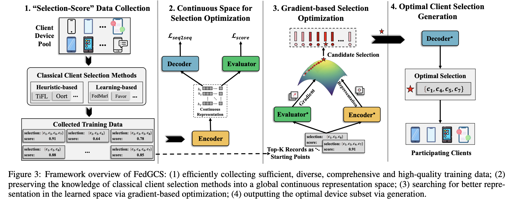

# [🔥 IJCAI 2024 ]GenerativeFL
This is the official codebase of the paper:
[FedGCS: A Generative Framework for Efficient Client Selection in Federated Learning via Gradient-based Optimization](https://arxiv.org/abs/2405.06312)

## Overview
**Framework overview of FedGCS:** 

1. Efficiently collecting sufficient, diverse, comprehensive and high-quality training data; 

2. Preserving the knowledge of classical client selection methods into a global continuous representation space; 

3. Searching for better representation in the learned space via gradient-based optimization; 

4. Outputting the optimal device subset via generation.


## Install

**Implementation Environment:** The model is implemented by using Pytorch. Using this command to implement your environment.
```
conda create -n GenerativeFL python=3.9
conda activate GenerativeFL
pip install -r requirements.txt
```

or
```
conda env create -f environment.yml
```

## 🕹️ Quickstart

```
bash mnist-lenet5-iid.sh
```


## Citation
```
@inproceedings{DBLP:conf/ijcai/NingT00WL0Z24,
  author       = {Zhiyuan Ning and
                  Chunlin Tian and
                  Meng Xiao and
                  Wei Fan and
                  Pengyang Wang and
                  Li Li and
                  Pengfei Wang and
                  Yuanchun Zhou},
  title        = {FedGCS: {A} Generative Framework for Efficient Client Selection in
                  Federated Learning via Gradient-based Optimization},
  booktitle    = {Proceedings of the Thirty-Third International Joint Conference on
                  Artificial Intelligence, {IJCAI} 2024, Jeju, South Korea, August 3-9,
                  2024},
  pages        = {4760--4768},
  publisher    = {ijcai.org},
  year         = {2024},
  url          = {https://www.ijcai.org/proceedings/2024/526},
  timestamp    = {Fri, 18 Oct 2024 20:53:56 +0200},
  biburl       = {https://dblp.org/rec/conf/ijcai/NingT00WL0Z24.bib},
  bibsource    = {dblp computer science bibliography, https://dblp.org}
}
```
## Acknowledgement
The code refers to the repo [plato](https://github.com/TL-System/plato).